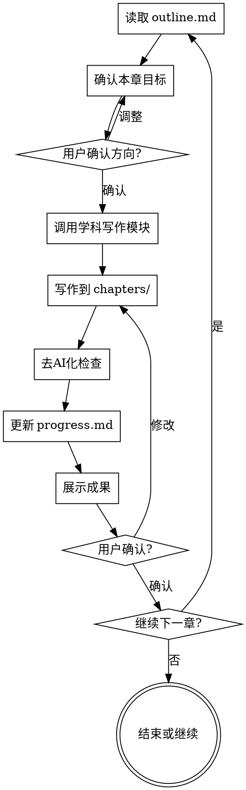

# 章节写作

负责论文各章节的实际写作。必须在头脑风暴完成、项目结构创建后调用。

<HARD-GATE>
调用此技能前必须满足以下条件：
1. plan/project-overview.md 存在且包含论文类型和章节结构
2. plan/outline.md 存在且已确认
3. chapters/ 目录已创建

如果任何条件不满足，必须先调用 brainstorming-research 技能。
</HARD-GATE>

## Checklist（每章必须完成）

- [ ] 读取 plan/outline.md 确认本章目标和要点
- [ ] 检查前置章节是否完成（按逻辑顺序）
- [ ] 与用户确认本章关键论点和内容方向
- [ ] 根据学科领域调用对应写作模块
- [ ] 写作输出到 chapters/XX-name.md
- [ ] **阶段1：规范合规检查**
- [ ] **阶段2：质量检查（去AI化、语言流畅度）**
- [ ] 更新 plan/progress.md
- [ ] 展示写作成果，询问用户确认或修改
- [ ] 用户确认后，询问是否继续下一章

## 两阶段 Review 机制

每章写作完成后，必须执行两阶段检查：

### 阶段1：规范合规检查

检查是否满足论文基本要求：

| 检查项 | 说明 |
|--------|------|
| 字数 | 是否达到目标字数（±10%可接受）|
| 结构 | 章节结构是否完整，小节是否清晰 |
| 引用格式 | 引用格式是否统一（GB/T 7714 或 APA）|
| 标题层级 | 是否符合论文规范 |

**检查结果**：✅ 通过 / ❌ 需修改

### 阶段2：质量检查

检查写作质量：

| 检查项 | 说明 |
|--------|------|
| 去AI化 | 无机械过渡词、无空壳强调句 |
| 语言流畅 | 无重复表达、无冗余 |
| 学术表达 | 使用"本文"、"本研究"等客观表述 |
| 段落结构 | 优先连贯段落，不使用列表堆砌 |
| 引用真实 | 所有引用可追溯，无编造 |

**检查结果**：✅ 通过 / ❌ 需修改

## 写作流程



## 写作前准备

### 1. 读取项目信息

从 plan/ 读取：
- project-overview.md：论文类型、学科、研究背景
- outline.md：章节大纲和要点
- progress.md：已完成章节
- notes.md：用户偏好和特殊要求

**参考结构模板**: `skills/brainstorming-research/templates.md` 了解不同论文类型的标准结构。

### 2. 确认当前章节

> "根据大纲，本章「[章节名]」的主要内容是：
> - [要点1]
> - [要点2]
> - [要点3]
> 
> 请确认这些要点，或告诉我需要调整的内容："

### 3. 调用学科模块

| 学科领域 | 调用模块 |
|----------|----------|
| 工科、理科 | writing-core |
| 文科 | writing-humanities |
| 社科 | writing-humanities（侧重数据）|
| 医学 | writing-medical |
| 法学 | writing-law |

## 写作规范

<EXTREMELY-IMPORTANT>
以下规范必须严格遵守，不得因为"效率"或"简化"而跳过。
</EXTREMELY-IMPORTANT>

### 去 AI 化写作

1. **禁用机械过渡词**：首先、其次、最后、此外、另外、总之
2. **禁用空壳强调句**：值得注意的是、需要指出的是、重要的是、显而易见
3. **禁用主观化表达**：我认为、我觉得、我的研究（正文中）
4. **禁用列表堆砌**：论文正文优先连贯段落，不使用项目符号
5. **语气客观**：使用"本文"、"本研究"、"研究表明"等客观表述

### 格式规范

1. **段落之间空一行**
2. **正文不使用加粗**（除术语首次定义）
3. **不使用斜体强调**
4. **标题层级清晰**

### 引用规范

1. **绝不编造文献**
2. **引用必须可追溯**：作者、年份、出处至少完整两项
3. **英文文献可检索后引用**
4. **中文文献优先让用户提供来源**

## 章节写作模板

### 开始写作前的确认

> "我将开始写作「[章节名]」。
> 
> **本章目标**：[从outline读取]
> **预计字数**：[根据论文类型估算]
> **包含小节**：
> - [小节1]
> - [小节2]
> 
> 请确认或调整后开始写作："

### 写作完成后的展示

> "「[章节名]」初稿已完成。
> 
> **实际字数**：[字数]
> **主要内容**：[简要总结]
> 
> 已保存到：chapters/[文件名].md
> 
> 请审阅以下内容：
> 
> ---
> [章节内容预览，可以是开头部分]
> ---
> 
> 如需修改请告诉我具体位置和修改意见，确认无误后我将更新进度。"

### 更新进度

在 progress.md 中记录：

```markdown
## [日期] - [章节名]

- **状态**：已完成 / 待修改
- **字数**：[字数]
- **用户确认**：是 / 否
- **修改记录**：[如有]
```

## 特殊章节指导

### 摘要（Abstract）

- 留到正文全部完成后再写
- 中文摘要 300-500 字，英文摘要对应
- 结构：背景、目的、方法、结果、结论
- 不含引用、不含图表

### 绪论（Introduction）

- 研究背景（宏观到具体）
- 研究问题（现有不足）
- 研究目的和意义
- 研究内容和方法概述
- 论文结构安排

### 文献综述（Literature Review）

- 调用 literature-review 技能
- 按主题/时间/方法分类
- 必须有批判性分析
- 必须指出研究空白

### 研究方法（Methods）

- 详细到可复现
- 数据来源和处理
- 分析方法和工具
- 伦理说明（如适用）

### 结果与讨论

- 结果客观呈现
- 讨论联系文献
- 承认局限性
- 不夸大结论

### 结论（Conclusion）

- 总结研究发现
- 回应研究目的
- 指出创新点
- 提出未来方向

## 错误处理

### 如果 plan/ 不存在

> "检测到项目结构未创建。需要先完成头脑风暴才能开始写作。
> 
> 是否现在开始头脑风暴？"

调用 brainstorming-research。

### 如果前置章节未完成

> "建议先完成「[前置章节]」再写「[当前章节]」，因为：
> - [原因]
> 
> 是否要先写前置章节，还是跳过继续？"

记录用户选择到 notes.md。

### 如果用户要求跳过确认

> "理解你想加快进度。我会简化确认流程，但仍需要你在每章完成后简单确认。
> 
> 现在开始写作「[章节名]」。"

## 关键原则

- **一次只写一章** — 完成并确认后再开始下一章
- **每章必须确认** — 不得自动继续
- **进度必须更新** — 每次写作后更新 progress.md
- **风格必须一致** — 遵循学科模块规范
- **引用必须真实** — 绝不编造
